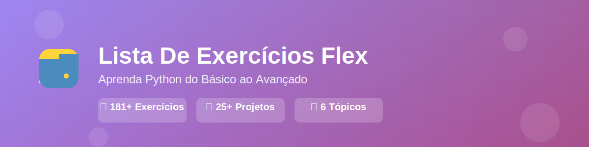

<div align="center">



### 🎓 Repositório Completo de Exercícios Python para Modalidade Flex

[](https://www.python.org/)
[](exercicios/)
[](projetos/)
[](LICENSE)

**Bem-vindo à Lista-De-Ex-Flex!** 🚀

Repositório de exercícios práticos de Python organizados por tópicos para estudantes da modalidade **Flex**. Aqui você encontra centenas de exercícios para treinar desde o básico até conceitos avançados, além de projetos práticos completos.

[📚 Ver Exercícios](exercicios/) • [🏆 Ver Projetos](projetos/) • [📖 Recursos](recursos/)

</div>

---

## 📋 Sobre Este Repositório

Este material foi desenvolvido especialmente para alunos da modalidade Flex, com exercícios progressivos que cobrem todos os fundamentos de Python necessários para se tornar um programador competente.

**O que você vai encontrar:**
- ✅ Exercícios organizados por nível e tópico
- ✅ Projetos práticos para aplicar o conhecimento
- ✅ Guias de referência rápida
- ✅ Material complementar e dicas de estudo

---

## 🗂️ Estrutura do Repositório

```
📦 Lista-De-Ex-Flex
├── 📁 exercicios/          # Exercícios organizados por tópico
├── 📁 projetos/            # Projetos práticos completos
└── 📁 recursos/            # Material de referência e guias
```

---

## 📚 Exercícios por Tópico

### 🌟 [1. Condicionais](exercicios/01-condicionais.md)
Aprenda estruturas de decisão (if/elif/else) com exercícios práticos do cotidiano.

**Tópicos abordados:**
- Condicionais simples e compostas
- Operadores de comparação
- Lógica booleana
- Cálculos com condições

**Total:** 10 exercícios (8 básicos + 2 avançados)

---

### 🔄 [2. While Loops](exercicios/02-while.md)
Domine laços de repetição com `while` através de simulações e jogos.

**Tópicos abordados:**
- Loops com condição
- Contadores e acumuladores
- Validação de entrada
- Menus interativos
- Jogos e simulações

**Total:** 20 exercícios (10 básicos + 10 avançados)

---

### 🔁 [3. For Loops](exercicios/03-for.md)
Pratique iteração sobre listas, ranges e estruturas de dados.

**Tópicos abordados:**
- Iteração com `range()`
- Loops em listas
- `enumerate()` e `zip()`
- Análise de dados
- Processamento de listas

**Total:** 20 exercícios (10 básicos + 10 avançados)

---

### 📋 [4. Listas e Tuplas](exercicios/04-listas-tuplas.md)
Manipule coleções de dados com listas mutáveis e tuplas imutáveis.

**Tópicos abordados:**
- Métodos de listas
- Fatiamento (slicing)
- Tuplas e imutabilidade
- Desempacotamento
- Conversões entre tipos

**Total:** 38 exercícios + projetos práticos

---

### 🗂️ [5. Dicionários e Sets](exercicios/05-dicionarios-sets.md)
Trabalhe com estruturas de dados avançadas: dicionários e conjuntos.

**Tópicos abordados:**
- Métodos de dicionários
- Dictionary comprehension
- Operações com sets
- Operações matemáticas de conjuntos
- Estruturas combinadas

**Total:** 50 exercícios + desafios combinados

---

### 🎯 [6. Funções e Módulos](exercicios/06-funcoes-modulos.md)
Organize seu código com funções, módulos e bibliotecas.

**Tópicos abordados:**
- Definição e chamada de funções
- Parâmetros e retornos
- *args e **kwargs
- Criação de módulos
- Bibliotecas padrão (stdlib)
- Gestão de pacotes

**Total:** 43 exercícios + boas práticas

---

## 🏆 [Projetos Práticos](projetos/README.md)

Aplique todo o conhecimento em projetos completos e funcionais!

### Categorias de Projetos:
- 🎲 **Jogos e Simulações** - Adivinhe o Número, Caixa Eletrônico, etc.
- 📊 **Sistemas de Gestão** - Estoque, Finanças, Tarefas
- 🗂️ **Aplicações com Dados** - Agendas, Catálogos, Rankings
- 🔧 **Projetos Modulares** - Calculadora, Gerador de Senhas, APIs

**Total:** 25+ projetos completos

---

## 📚 [Recursos e Referências](recursos/README.md)

Material complementar para auxiliar nos estudos:

- 📖 **Guias de Referência Rápida** - Sintaxe, operadores, estruturas
- 🗂️ **Tabelas de Métodos** - Listas, dicionários, sets
- 🎯 **Boas Práticas** - Nomenclatura, estrutura, validação
- 📝 **Templates Úteis** - Menus, validação, arquivos
- 🐛 **Debugging** - Como identificar e corrigir erros
- 🎓 **Progressão de Estudos** - Roteiro completo
- 💡 **Dicas de Estudo** - Como aproveitar melhor o material

---

## 🚀 Como Usar Este Material

### Para Iniciantes
1. Comece pelos exercícios de **Condicionais**
2. Avance progressivamente pelos tópicos
3. Faça todos os exercícios básicos antes dos avançados
4. Consulte os **Recursos** sempre que precisar

### Para Intermediários
1. Revise os tópicos que tiver dúvida
2. Foque nos exercícios avançados
3. Tente resolver sem consultar soluções
4. Comece pelos projetos práticos

### Para Praticar
1. Escolha um tópico específico
2. Faça os exercícios em sequência
3. Teste seu código
4. Tente variações dos exercícios
5. Combine conceitos em projetos próprios

---

## 📊 Resumo do Conteúdo

| Tópico | Exercícios | Nível | Tempo Estimado |
|--------|------------|-------|----------------|
| Condicionais | 10 | Iniciante | 2-3 horas |
| While Loops | 20 | Iniciante/Intermediário | 4-5 horas |
| For Loops | 20 | Iniciante/Intermediário | 4-5 horas |
| Listas e Tuplas | 38 | Intermediário | 6-8 horas |
| Dicionários e Sets | 50 | Intermediário/Avançado | 8-10 horas |
| Funções e Módulos | 43 | Intermediário/Avançado | 6-8 horas |
| **Projetos** | 25+ | Todos os níveis | Variável |

**Total:** 181+ exercícios individuais + 25+ projetos completos

---

## 💡 Dicas de Estudo

### ✅ **Faça, Não Apenas Leia**
- Não basta ler os exercícios, você precisa **programar**
- Digite o código, não copie e cole
- Teste cada exercício no seu computador

### ✅ **Pratique Regularmente**
- É melhor 30 minutos por dia do que 5 horas no fim de semana
- Estabeleça uma rotina de estudos
- Revise conceitos anteriores periodicamente

### ✅ **Entenda, Não Decore**
- Entenda a lógica por trás do código
- Experimente modificar os exercícios
- Crie suas próprias variações

### ✅ **Peça Ajuda Quando Precisar**
- Não fique preso muito tempo em um problema
- Discuta com colegas e professor
- Use os recursos disponíveis

---

## 🛠️ Ferramentas Recomendadas

### Editores/IDEs
- **VS Code** - Editor leve e poderoso (recomendado)
- **PyCharm** - IDE completa para Python
- **Replit** - IDE online para praticar

### Python
- Instale o **Python 3.8+** no seu computador
- Use um ambiente virtual para projetos

---

## 🤝 Como Contribuir

### Para Alunos
- Reporte erros ou sugestões
- Compartilhe suas soluções criativas
- Sugira novos exercícios

### Para Professores
1. Faça um fork deste repositório
2. Crie uma branch para suas modificações
3. Envie um pull request com melhorias

---

## 📞 Suporte

- **Professor:** DevWizardMarcos
- **Modalidade:** Flex
- **Disciplina:** Programação em Python

---

## 📝 Notas Importantes

### ⚠️ Sobre as Soluções
Este repositório contém **enunciados de exercícios**, não soluções prontas. Isso é proposital para incentivar o aprendizado ativo.

### 📖 Licença de Uso
Este material é educacional e de uso livre para fins de estudo.

---

## 🎯 Objetivos de Aprendizagem

Ao completar este material, você será capaz de:

✅ Escrever programas Python com lógica complexa  
✅ Manipular diferentes estruturas de dados  
✅ Criar funções e módulos reutilizáveis  
✅ Resolver problemas práticos com código  
✅ Organizar projetos de forma profissional  
✅ Ler e entender código de outros programadores  
✅ Debugar e corrigir erros  
✅ Aplicar boas práticas de programação  

---

## 🌟 Citação Motivacional

> *"A única maneira de aprender a programar é programando."*  
> — Dennis Ritchie

---

## 🗺️ Roadmap de Estudos Sugerido

```
Semana 1-2:  Condicionais + While Loops
Semana 3-4:  For Loops + Listas
Semana 5-6:  Tuplas + Dicionários
Semana 7-8:  Sets + Funções
Semana 9-10: Módulos + Projetos Iniciais
Semana 11+:  Projetos Avançados + Revisão
```

---

## 🔗 Links Rápidos

- 📚 [Exercícios](exercicios/)
- 🏆 [Projetos](projetos/)
- 📖 [Recursos](recursos/)

---

## ⭐ Sobre o Material

**Criado com** 💙 **por DevWizardMarcos**

Material desenvolvido especificamente para alunos da modalidade **Flex**, com foco em aprendizado progressivo e prático.

**Última atualização:** 2024

---

## 📬 Feedback

Sua opinião é importante! Se você:
- ✅ Encontrou algum erro
- ✅ Tem sugestões de melhoria
- ✅ Quer sugerir novos exercícios
- ✅ Gostou do material

Entre em contato ou abra uma issue!

---

<div align="center">

### 🚀 Bons Estudos e Sucesso na Sua Jornada Python! 🐍

</div>

---

**Feito com 💙 por DevWizardMarcos e colaboradores.**
